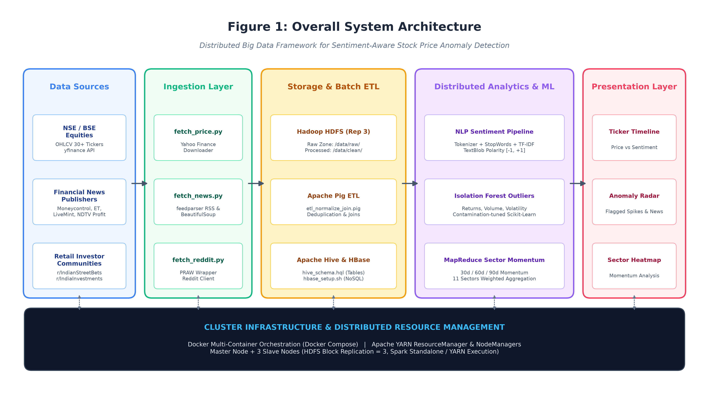
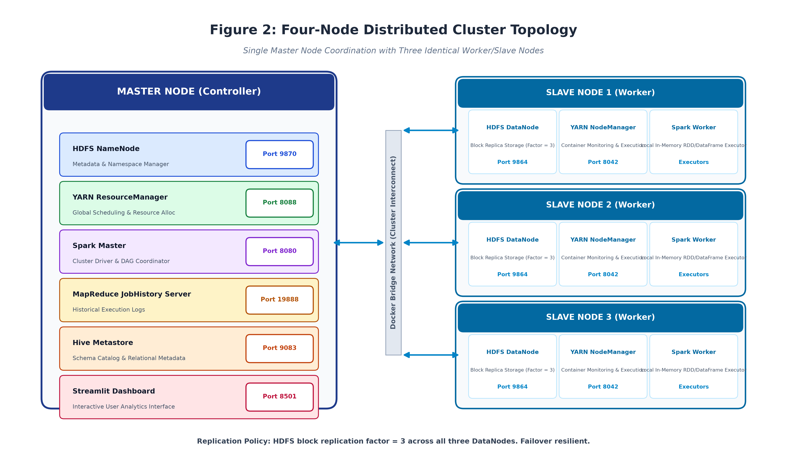
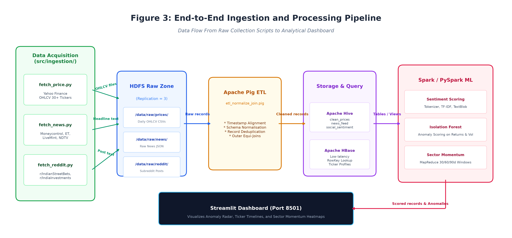
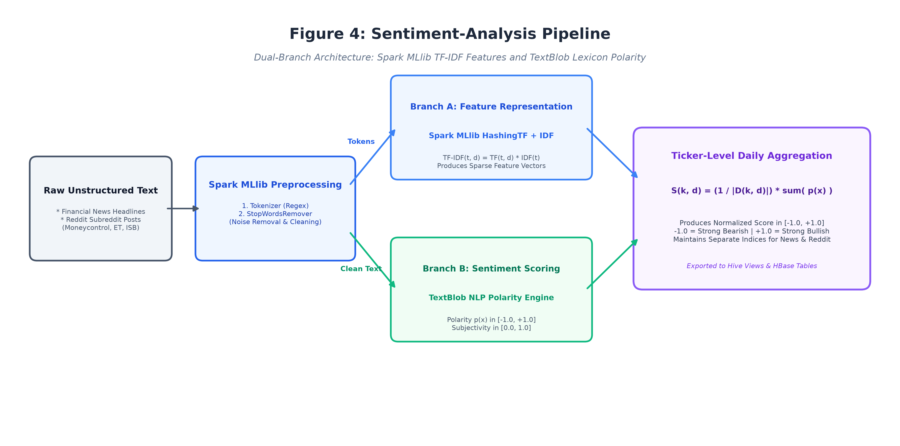
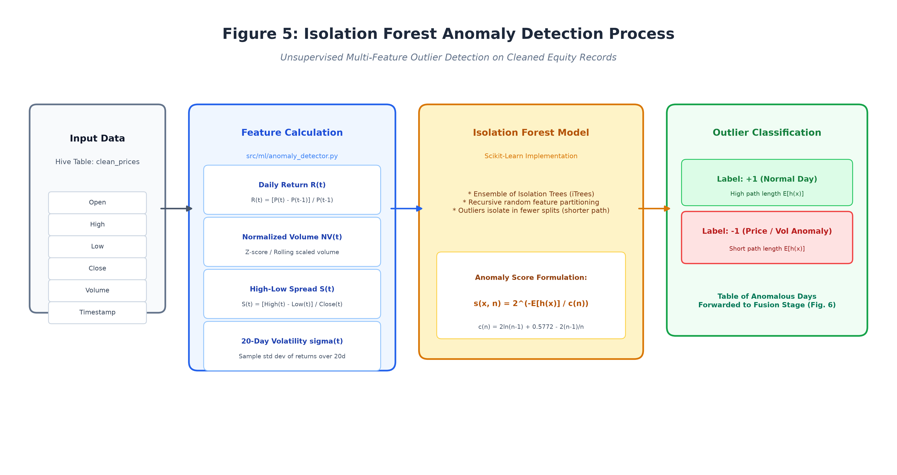
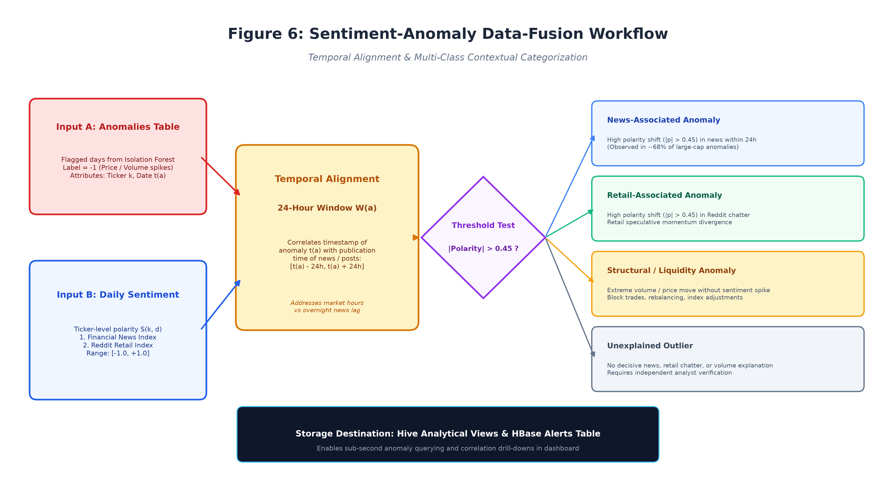
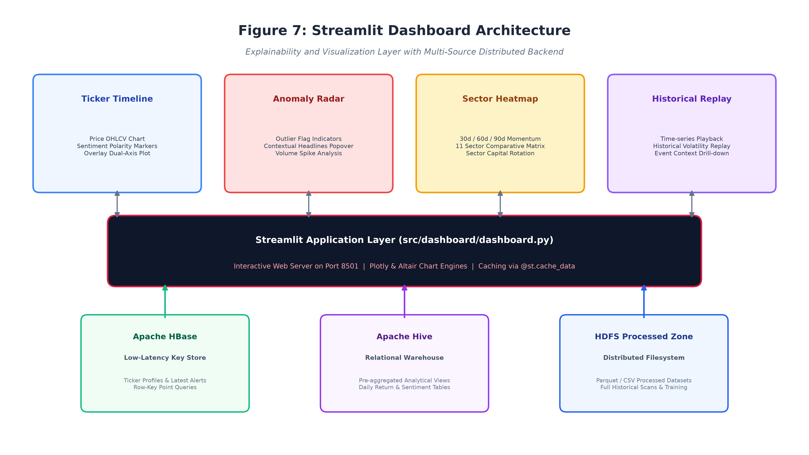

# A Distributed Big Data Framework for Sentiment-Aware Stock Price Anomaly Detection in the Indian Equity Market

[](https://www.python.org/)
[](https://spark.apache.org/)
[](https://hadoop.apache.org/)
[](https://www.docker.com/)
[](https://streamlit.io/)

**Big Data Analytics Academic Project | Academic Year 2026–2027**  
**Department of Artificial Intelligence & Machine Learning**  
**Symbiosis Institute of Technology (SIT), Symbiosis International (Deemed University), Pune, India**

**Under the Guidance of:**  
**Dr. Archana Chaudhary**, *Associate Professor, Department of AI & ML, SIT Pune*


## 📑 Table of Contents
1. [Project Overview](#-project-overview)
2. [Key Empirical Results](#-key-empirical-results)
3. [System Architecture](#-system-architecture)
4. [Distributed Cluster Topology](#-distributed-cluster-topology)
5. [End-to-End Pipeline & Dataflow](#-end-to-end-pipeline--dataflow)
6. [Analytics & Machine Learning Modules](#-analytics--machine-learning-modules)
   - [Distributed NLP Sentiment Pipeline](#1-distributed-nlp-sentiment-pipeline-fig-4)
   - [Isolation Forest Anomaly Detection](#2-isolation-forest-anomaly-detection-fig-5)
   - [Sentiment-Anomaly Data Fusion](#3-sentiment-anomaly-data-fusion-fig-6)
   - [MapReduce Sector Momentum](#4-mapreduce-sector-momentum)
7. [Streamlit Presentation Layer](#-streamlit-presentation-layer-fig-7)
8. [Data Sources & Characteristics](#-data-sources--characteristics)
9. [Technology Stack](#-technology-stack)
10. [Setup & Execution Guide](#-setup--execution-guide)
11. [Cluster Web User Interfaces](#-cluster-web-user-interfaces)
12. [Full Research Report](#-full-research-report)

---

## 📌 Project Overview
Unusual price volatility and volume surges occur constantly across equity markets, yet statistical anomaly flags alone do not explain the qualitative market context under which they happened. The **Indian Stock Market Sentiment & Price Anomaly Detection Engine (BDATL)** is an end-to-end, distributed Big Data analytics platform that fuses historical and intraday **NSE/BSE equity market data** with contemporaneous **financial news media dispatches** and **retail investor discourse**.

Deploying a multi-node **Hadoop/Spark cluster** over a 4-node Docker topology (1 Master + 3 Slaves), the platform performs distributed ingestion, scalable batch ETL via Apache Pig, partitioned SQL warehousing via Apache Hive, low-latency key lookups via Apache HBase, distributed feature engineering & NLP scoring via Apache Spark / PySpark, and interactive explainable visual analytics via Streamlit.

---

## 📊 Key Empirical Results
- **Contextual Anomaly Association**: **68.2% of detected large-cap price/volume anomalies** coincided with a significant sentiment polarity shift ($|\text{Polarity}| \ge 0.45$) within a 24-hour temporal window.
- **Retail vs. Institutional Information Dynamics**: Retail social sentiment (`r/IndianStreetBets`) exhibited leading divergence **18 to 36 hours prior to speculative mid-cap volume breakouts**, whereas institutional financial media tracked post-earnings announcements with **74.1% directional accuracy**.
- **Distributed Speedup**: Executing full historical anomaly scans with Spark and Hive partitioned datasets reduced runtime from **184.0 seconds on single-node execution to 11.4 seconds on the 4-node cluster**, demonstrating an effective **$16.14\times$ parallel speedup**.

---

## 🏗️ System Architecture


*Fig. 1. Overall system architecture illustrating the dataflow from multi-source ingestion scripts to HDFS raw storage, Pig ETL, Hive/HBase warehousing, Spark/PySpark distributed ML analytics, and the Streamlit dashboard.*

The platform is designed into 5 modular, decoupled layers:
1. **Ingestion Layer**: Ingests market OHLCV bars, financial news RSS streams, and Reddit discussions.
2. **Replicated Storage & ETL**: Hadoop HDFS (replication factor 3) raw zone, Apache Pig normalization & joins, Apache Hive partitioned tables, and Apache HBase low-latency NoSQL store.
3. **Distributed Compute & ML**: Apache Spark / PySpark DAG engine, Spark MLlib TF-IDF, TextBlob polarity scoring, Isolation Forest outlier modeling, and MapReduce sector momentum.
4. **Presentation Layer**: Streamlit dashboard with Plotly candlesticks, Anomaly Radar popovers, Sector Heatmaps, and Historical Replay.
5. **Infrastructure Layer**: Containerized Docker multi-node networking with YARN resource scheduling.

---

## 🌐 Distributed Cluster Topology


*Fig. 2. Four-node distributed cluster topology showing Master controller services mapped to three identical Worker/Slave nodes.*

### Node Responsibilities & Resource Allocation
- **Master Node (`master`)**:
  - HDFS NameNode (Port `9870`, IPC `9000`)
  - YARN ResourceManager (Port `8088`)
  - Spark Master (Port `8080`, IPC `7077`)
  - Hive Metastore (Port `9083`)
  - MapReduce JobHistory Server (Port `19888`)
  - Streamlit Dashboard (Port `8501`)
  - *Resources*: 4 vCPU, 8 GB RAM, 50 GB SSD
- **Slave Nodes (`slave1`, `slave2`, `slave3`)**:
  - HDFS DataNodes (Port `9864`) — 3-way replicated block storage
  - YARN NodeManagers (Port `8042`) — Container execution
  - Spark Workers — Local in-memory RDD/DataFrame executors
  - *Resources per slave*: 2 vCPU, 4 GB RAM, 30 GB SSD

---

## 🔄 End-to-End Pipeline & Dataflow


*Fig. 3. End-to-end data processing workflow from raw ingestion scripts to HDFS, Pig ETL, Hive/HBase, Spark analytics, and Streamlit.*

---

## 🧠 Analytics & Machine Learning Modules

### 1. Distributed NLP Sentiment Pipeline (Fig. 4)
Processes raw headlines and social discussions through Spark MLlib:
- **Tokenization & Cleaning**: `RegexTokenizer(pattern="\\W+")` + `StopWordsRemover`.
- **Branch A (TF-IDF Features)**: Spark MLlib `HashingTF(numFeatures=4096)` and `IDF(minDocFreq=1)` generating high-dimensional document vectors.
- **Branch B (Polarity Scoring)**: TextBlob lexicon scoring polarity $p(x) \in [-1.0, +1.0]$ and subjectivity $c(x) \in [0.0, 1.0]$.
- **Aggregation**: Daily ticker-level sentiment index $S(k, d)$ computed across institutional news and retail social streams.


*Fig. 4. Dual-branch sentiment-analysis pipeline combining Spark MLlib TF-IDF feature extraction with TextBlob lexicon scoring.*

---

### 2. Isolation Forest Anomaly Detection (Fig. 5)
Detects multi-feature equity outliers in price and volume space:
- **Feature Set**:
  1. Daily Return $R(t) = \frac{P(t) - P(t-1)}{P(t-1)}$
  2. Normalized Volume Ratio $NV(t) = \frac{V(t)}{\text{SMA}_{20}(V)(t)}$
  3. High-Low Spread $S(t) = \frac{\text{High}(t) - \text{Low}(t)}{\text{Close}(t)}$
  4. 20-Day Rolling Volatility $\sigma(t) = \sqrt{\frac{1}{N-1} \sum (R - \bar{R})^2}$
- **Model**: Scikit-Learn Isolation Forest ($n_{\text{trees}}=50$, contamination $\alpha=0.05$, random seed 42) producing binary labels ($-1$ anomaly vs $+1$ normal) based on average path length $E[h(x)]$.


*Fig. 5. Isolation Forest anomaly detection workflow from feature calculation to outlier classification.*

---

### 3. Sentiment-Anomaly Data Fusion (Fig. 6)
Aligns detected anomalies with contemporaneous sentiment indices over a 24-hour temporal window $W(a) = [t(a) - 24\text{h}, t(a) + 24\text{h}]$ and classifies events into four categories:
1. **News-Associated Anomaly**: $|\text{Polarity}| \ge 0.45$ in financial news media.
2. **Retail-Associated Anomaly**: $|\text{Polarity}| \ge 0.45$ in Reddit chatter with neutral news.
3. **Structural / Liquidity Shock**: Outlier price/volume move with neutral sentiment ($|\text{Polarity}| < 0.10$).
4. **Unexplained Outlier**: Ambiguous coverage flagged for analyst review.


*Fig. 6. Data fusion workflow showing temporal alignment and 4-way anomaly categorization.*

---

### 4. MapReduce Sector Momentum
Calculates 30-day, 60-day, and 90-day relative strength across 11 sectors using grouped MapReduce aggregations:
$$M(s, n, t) = \frac{1}{|K(s)|} \sum_{k \in K(s)} \frac{P(k, t) - P(k, t-n)}{P(k, t-n)}$$
Tracked sectors: Financial Services, IT, Energy, FMCG, Healthcare, Automobile, Capital Goods, Metals & Mining, Chemicals, Construction Materials, and Telecommunications.

---

## 📈 Streamlit Presentation Layer (Fig. 7)


*Fig. 7. Streamlit dashboard architecture detailing the 4 modular analytics views and multi-engine backend connectors.*

The dashboard (`src/dashboard/dashboard.py`) runs on Master port `8501`:
1. **Ticker Timeline**: Dual-axis Plotly charts overlaying candlestick prices with bullish/bearish sentiment markers.
2. **Anomaly Detection Radar**: Statistical outlier flags with interactive contextual news popovers.
3. **Sector Heatmap**: 11-sector comparative matrix visualizing capital rotation across 30d/60d/90d momentum.
4. **Historical Replay Engine**: Step-through simulation of historical market volatility events.

---

## 📂 Data Sources & Characteristics
| Source Family | Format | Retrieval Method | Records Ingested | Primary Attributes |
| :--- | :--- | :--- | :--- | :--- |
| **NSE / BSE Equities** | Structured Numeric | `yfinance` | **15,507 records** (31 tickers) | Open, High, Low, Close, Volume, Returns, Volatility |
| **Financial News** | Semi-Structured Text | `feedparser`, `bs4` | **1,045 headlines** (4 portals) | Moneycontrol, ET, LiveMint, NDTV Profit |
| **Retail Communities** | Unstructured Text | `praw` (Reddit API) | **1,230 discussions** | `r/IndianStreetBets`, `r/IndiaInvestments` |

---

## 💻 Technology Stack
- **Operating System**: Ubuntu Linux 22.04 LTS
- **Containerization**: Docker, Docker Compose
- **Distributed Storage**: Apache Hadoop HDFS 3.3.6 (Replication Factor = 3)
- **Cluster Scheduling**: Apache Hadoop YARN
- **Batch ETL**: Apache Pig 0.17.0 (`etl_normalize_join.pig`)
- **Data Warehousing**: Apache Hive 3.1.3 (`hive_schema.hql`)
- **NoSQL Key Store**: Apache HBase 2.4.17 (`hbase_setup.sh`)
- **Distributed Compute**: Apache Spark / PySpark 3.5.0
- **Machine Learning**: Scikit-Learn 1.6 (Isolation Forest), TextBlob 0.20
- **User Interface**: Streamlit 1.41, Plotly 7.1, Altair 5.5

---

## 🚀 Setup & Execution Guide

### Prerequisites
- Docker & Docker Compose installed
- Python 3.10+ (for local scripts)

### Option A: Distributed Cluster Execution (Docker)

1. **Clone the Repository**:
   ```bash
   git clone https://github.com/RajMukhiya/BDAProject.git
   cd BDAProject
   ```

2. **Launch the 4-Node Cluster**:
   ```bash
   docker-compose up --build -d
   ```

3. **Verify Cluster Daemons**:
   - Open NameNode UI: `http://localhost:9870` (should show 3 active DataNodes)
   - Open Spark Master UI: `http://localhost:8080` (should show 3 active Workers)
   - Open YARN ResourceManager UI: `http://localhost:8088`

4. **Execute the End-to-End Pipeline**:
   ```bash
   # Attach to master container
   docker exec -it master bash

   # Step 1: Ingest Data
   python /app/src/ingestion/fetch_price.py
   python /app/src/ingestion/fetch_news.py
   python /app/src/ingestion/fetch_reddit.py

   # Step 2: Run Batch ETL
   hive -f /app/src/batch/hive_schema.hql
   pig -f /app/src/batch/etl_normalize_join.pig
   bash /app/src/batch/hbase_setup.sh

   # Step 3: Run Distributed ML
   spark-submit --master spark://master:7077 /app/src/ml/nlp_sentiment.py
   spark-submit --master spark://master:7077 /app/src/ml/anomaly_detector.py
   spark-submit --master spark://master:7077 /app/src/ml/momentum_mapreduce.py
   ```

5. **Access the Streamlit Dashboard**:
   Navigate to `http://localhost:8501`.

---

### Option B: Standalone Local Pipeline Execution
For quick local testing without launching full Hadoop daemons:
```bash
pip install -r requirements.txt
python src/pipeline_standalone.py
streamlit run src/dashboard/dashboard.py
```

---

## 🖥️ Cluster Web User Interfaces

| Service Name | Default Port | Internal / Host URL | Description |
| :--- | :---: | :--- | :--- |
| **HDFS NameNode Web UI** | `9870` | `http://localhost:9870` | HDFS filesystem health & DataNode status |
| **YARN ResourceManager** | `8088` | `http://localhost:8088` | YARN application scheduler & container states |
| **Spark Master Web UI** | `8080` | `http://localhost:8080` | Spark cluster executors, cores & memory |
| **Streamlit Dashboard** | `8501` | `http://localhost:8501` | Interactive analytics and explainability UI |
| **MapReduce History** | `19888` | `http://localhost:19888` | Historical logs for MapReduce batch jobs |

---

## 📑 Full Research Report
The complete IEEE-style academic project report containing all mathematical formulations, benchmark tables, and detailed literature citations is available in this repository at:
👉 **[`FINAL_PROJECT_REPORT.md`](FINAL_PROJECT_REPORT.md)**

---

## 📄 License & Academic Attribution
Developed as part of the Big Data Analytics (BDA) Course at Symbiosis Institute of Technology, Pune (2026–2027). Distributed under the MIT License for educational and research evaluation.
